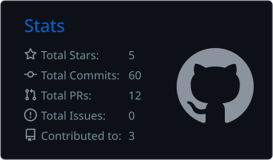
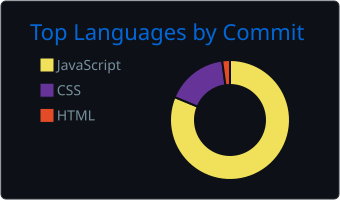

<div align="center">



<br/>

**Backend Engineer** · NestJS · Node · AWS · fintech<br/>
Rosario, Argentina 🇦🇷

[](https://agustindemarco.com)
[](https://www.linkedin.com/in/agustindemarco/)
[](mailto:demarcoagustinn@gmail.com)

</div>

---

## `~/about`

```ts
const agustin = {
  location: "Rosario, Santa Fe, Argentina",
  role: "Full-Stack Developer @ Nave Negocios",
  education: "Information Systems Engineering — UCEL (2019–2024)",
  focus: ["Microservices", "Cloud Architecture", "Serverless", "Fintech"],
  currentlyExploring: ["Advanced AWS patterns", "Self-hosted AI agents"],
  offTheClock: ["Homelab (Proxmox)", "Self-hosting", "3D printing"],
};
```

I design and build backend-heavy products end to end: **NestJS** services and BFFs, **PostgreSQL** data models, **Next.js** frontends and **AWS serverless** infrastructure. Most of my experience is in **fintech**, where I've migrated legacy systems to the cloud, set up CI/CD pipelines and led backend teams.

> The work nobody sees but everyone uses. → **[See it all at agustindemarco.com](https://agustindemarco.com)**

---

## `~/projects`

| Project | What it is | Stack |
|---|---|---|
| **[AUREVA](https://aureva.com.ar)** | Site + online booking system with admin panel for an aesthetic medicine practice | Next.js · Node · PostgreSQL |
| **[Aprende SQL](https://agustindemarco.com/aprende-sql)** | Interactive SQL course that runs entirely in the browser (WASM playground, exercises, exam) | Next.js · sql.js |
| **Changuito** | Embeddable cart & checkout for local SMBs | Node · Next.js · PostgreSQL |
| **Goleros** | Booking and hour tracking for football pitches (−25% booking time) | Node · MongoDB · React Native |
| **Anesthesia System** | Hospital procedure logging (+30% reporting accuracy) | Node · PostgreSQL · React |
| **[Portfolio](https://agustindemarco.com)** | This site's big sibling: boot sequence, live API explorer, Ctrl+K palette | Next.js · React Three Fiber |

---

## `~/experience`

| Role | Company | Period |
|------|---------|--------|
| **Full-Stack Developer** | Nave Negocios | Present |
| **Full-Stack Developer** | Banco Galicia | 2024 – 2025 |
| **Back-End & Solidity Developer** | Welook.io | 2024 |
| **Full-Stack Web Developer** | Onlines&Co. | 2021 |
| **Full-Stack Web Developer** | Axyoma | 2021 |
| **Freelance Developer** | Independent | 2020 – Present |

<details>
<summary><b>Highlights</b></summary>
<br>

- **Banco Galicia** — Built BFFs and services in a NestJS microservices architecture. Led the migration of a legacy on-premise system to AWS and helped implement CI/CD pipelines and cloud cost optimization.
- **Welook.io** — Led backend development: +40% system efficiency, −30% deployment time through CI/CD and cloud monitoring, and AI-driven features that raised user engagement by 25%.
- **Freelance** — Hospital management system for anesthesia procedure tracking (+30% reporting accuracy) and a work-hours scheduling system (+25% time-tracking efficiency).

</details>

---

## `~/stack`

<div align="center">

<br/>
<br/>
<br/>


</div>

---

## `~/metrics`

<div align="center">





</div>

---

<div align="center">

`$ echo "open to talking backend architecture, cloud and fintech"` → [LinkedIn](https://www.linkedin.com/in/agustindemarco/)


</div>
